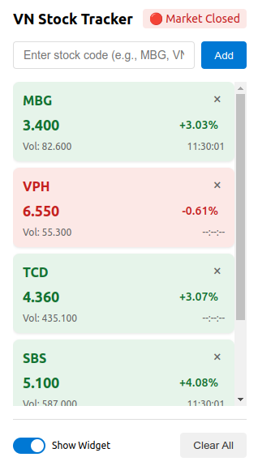

# VN Stock Tracker Extension

A browser extension that provides real-time Vietnamese stock market tracking with a convenient floating widget. Built for Chrome and Edge browsers.



## Features

- 🚀 Real-time stock price updates from SSI
- 📊 Floating widget that persists across all web pages
- 🎯 Drag-and-drop widget positioning
- 🎨 Color-coded price changes
- 📱 Minimizable widget interface
- 📈 Multiple stock tracking
- ⏰ Market hours indicator
- 🔄 Auto-updates every 5 minutes

## Installation

### From Web Store
- [Chrome Web Store](chrome-web-store-link) (Coming Soon)
- [Microsoft Edge Add-ons](edge-add-ons-link) (Coming Soon)

### Local Development
1. Clone this repository:
```bash
git clone https://github.com/yourusername/vn-stock-tracker.git

Load the extension in Chrome/Edge:

Open Chrome/Edge browser
Navigate to chrome://extensions or edge://extensions
Enable "Developer mode"
Click "Load unpacked"
Select the project directory


Usage
Click the extension icon in your browser toolbar
Enter stock codes (e.g., VNM, VIC) in the popup
The widget will appear on your web pages
Drag the widget to your preferred position
Use the minimize button to reduce widget size
Click the close button to hide the widget
Toggle widget visibility from the extension popup
Project Structurevn-stock-tracker/
├── manifest.json        # Extension manifest
├── popup.html          # Extension popup interface
├── popup.js           # Popup functionality
├── background.js      # Background service worker
├── content.js         # Widget injection and control
├── styles.css         # Styles for popup and widget
└── icons/             # Extension icons
DevelopmentPrerequisites
Basic knowledge of HTML, CSS, and JavaScript
Chrome or Edge browser
Text editor or IDE
APIThis extension uses the SSI API for stock data:
BuildingNo build process required. The extension runs directly from source.Testing
Make code changes
Go to chrome://extensions or edge://extensions
Click the refresh icon on the extension card
Test the changes on various websites
Contributing
Fork the repository
Create your feature branch (git checkout -b feature/AmazingFeature)
Commit your changes (git commit -m 'Add some AmazingFeature')
Push to the branch (git push origin feature/AmazingFeature)
Open a Pull Request
Privacy
No personal data is collected
Stock codes are stored locally
Only public market data is accessed
No third-party analytics
Known Issues
Widget position resets on page reload
Some websites may have styling conflicts
API rate limiting may affect update frequency
Roadmap
 Save widget position
 Custom update intervals
 Price alerts
 Dark mode support
 Export data functionality
 Additional market indicators
LicenseThis project is licensed under the MIT License - see the LICENSE file for details.Acknowledgments
Stock data provided by SSI
Icon assets from [https://www.streamlinehq.com]
If you find this project helpful, please consider giving it a star ⭐